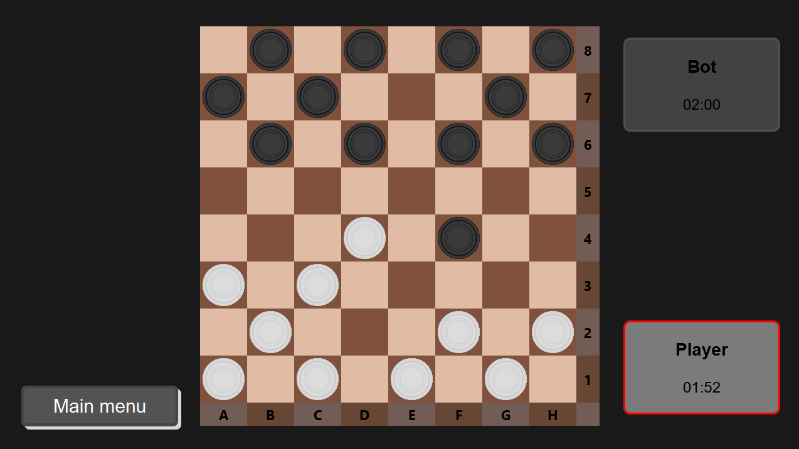

# Checkers

Checkers game with 3 modes and replay watcher. Created as college project.


## Screenshots




## Description

Game have 3 modes in which you can play.
- Cooperation - you play with other player on the same computer
- Singleplayer - you play with computer bot
- Multiplayer - you can connect with other player and play via Internet
######
You can set round time, or play with unlimited time. Every game is saved to file which you can see and analyze later. What`s more you can load this file in game and watch game step by step (currently not available for multiplayer game). Files on default are saved into ```Checkers/replays```.


## Run Locally

Clone the project

```bash
  git clone https://github.com/neyluu/Checkers.git
```

Go to the project directory

```bash
  cd Checkers
```

Start the game. Dependencies will be installed automatically.

```bash
    mvn clean javafx:run 
    #or 
    mvn javafx:run
```


## Tech Stack

Java + JavaFX